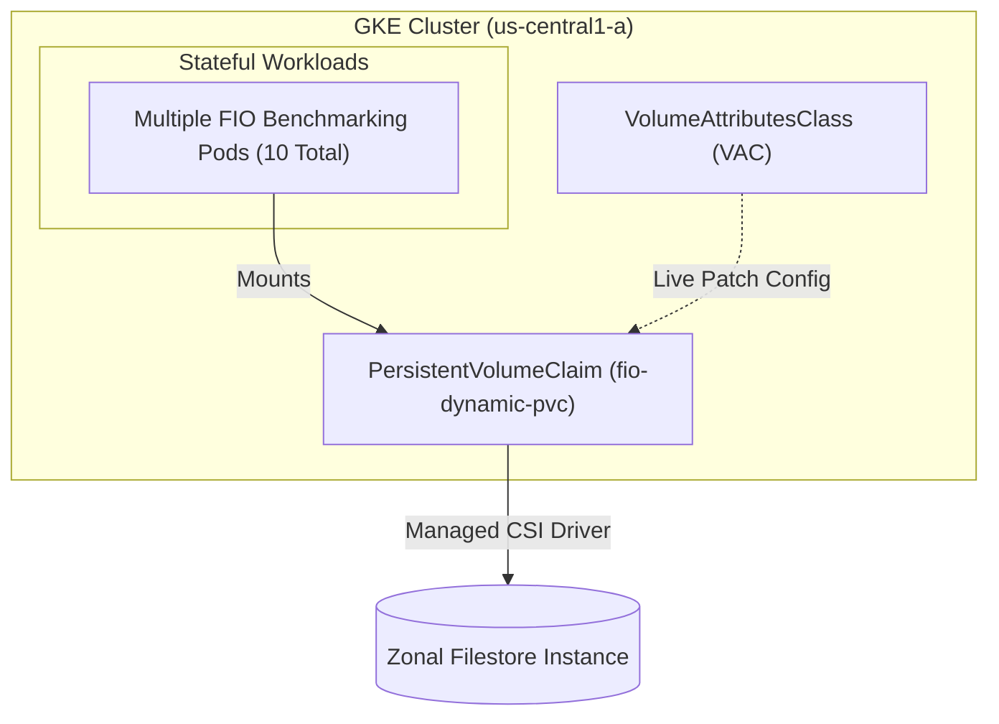

# Dynamic Performance Scaling & Zonal Resiliency with Filestore on GKE

[](https://cloud.google.com/kubernetes-engine)
[](https://cloud.google.com/filestore)
[](https://kubernetes.io/)

This repository contains the complete manifests, automated scripts, and step-by-step presentation guide for demonstrating **Google Cloud Filestore Zonal (`ReadWriteMany` / RWX)** with GKE.

The demo showcases five core capabilities:
1. **Dynamic Filestore Provisioning**: Automatically creating a Filestore Zonal instance via the GKE Filestore CSI driver (`zonal-rwx`).
2. **Multi-Pod RWX Workload**: Deploying a 10-replica Kubernetes workload distributed across separate cluster nodes using Pod Anti-Affinity, sharing a single Filestore volume mounted at `/mnt/filestore`.
3. **Distributed I/O Benchmarking**: Installing and executing synchronous background `fio` random-read workloads across all running pods.
4. **Online Performance Scaling via VolumeAttributesClass (VAC)**: Scaling up Filestore IOPS (from default limits up to **17,000 IOPS**) dynamically by patching the PVC without application downtime or pod restarts.
5. **Node Failure & Resilience Simulation**: Randomly terminating multiple GCE cluster node instances while storage I/O is active, demonstrating automatic node recovery, pod rescheduling, volume auto-remounting, and workload resumption.

---

## Demo Architecture

The demo is split into two major phases:

| Phase | Scenario | Kubernetes Mechanism | Under-the-Hood Event |
| :--- | :--- | :--- | :--- |
| **Phase 1** | **Dynamic Performance Scaling** | Patching `PersistentVolumeClaim` with `VolumeAttributesClass` | GKE Filestore CSI Driver communicates directly with the Filestore API to scale IOPS instantly without unmounting. |
| **Phase 2** | **Automated Node Resiliency** | GKE Pod Rescheduling & PVC Shared Volume Re-binding | A critical node failure is simulated. GKE relocates the affected pods, and the zonal Filestore share seamlessly reconnects. |



---

## Repository Structure

| File | Type | Description |
| :--- | :---: | :--- |
| [`vac-17k.yaml`](vac-17k.yaml) | K8s Manifest | Defines `VolumeAttributesClass` (`filestore-17k-iops`) configuring `max-iops: "17000"`. |
| [`dynamic-pvc.yaml`](dynamic-pvc.yaml) | K8s Manifest | `PersistentVolumeClaim` (`fio-dynamic-pvc`) requesting a `1Ti` volume with `ReadWriteMany` on `zonal-rwx`. |
| [`base-deployment.yaml`](base-deployment.yaml) | K8s Manifest | `Deployment` (`base-app`) running 10 Alpine replicas with host pod anti-affinity mounting `/mnt/filestore`. |
| [`install_fio.sh`](install_fio.sh) | Script | Installs `fio` via `apk update && apk add fio` inside all active `app=fio-tester` pods. |
| [`run_fio.sh`](run_fio.sh) | Script | Starts background random-read (`randread`, 4KB block size, time-based) `fio` benchmarks per pod. |
| [`list_fio_pods.sh`](list_fio_pods.sh) | Script | Formatted CLI table listing pods, assigned GCE node hosts, mount sources, mount status, and `fio` health. |
| [`failure_simulation.sh`](failure_simulation.sh) | Script | Primary failure script: deletes 3 random GCE node instances in parallel, monitors recovery, and re-triggers load. |
| [`simulate_1_node_failure.sh`](simulate_1_node_failure.sh) | Script | Alternative failure script for testing single-node loss and recovery. |
| [`simulate_3_node_failure.sh`](simulate_3_node_failure.sh) | Script | Alternative failure script that deletes 3 random nodes sequentially. |
| [`stop_fio.sh`](stop_fio.sh) | Script | Stops active `fio` benchmark processes across all matching pods. |
| [`kill_fio.sh`](kill_fio.sh) | Script | Sends explicit `TERM` signals to matching `fio` process PIDs across pods. |

---

## Prerequisites & Setup

### 1. Required GCP APIs & Permissions
Ensure you have active billing and enable the necessary Google Cloud APIs:

```bash
gcloud services enable container.googleapis.com \
                       file.googleapis.com \
                       compute.googleapis.com
```

Your identity or service account requires the following roles:
- **Kubernetes Engine Admin** (`roles/container.admin`)
- **Filestore Admin** (`roles/file.admin`)
- **Compute Instance Admin (v1)** (`roles/compute.instanceAdmin.v1`) — required for simulating node deletion.

### 2. Environment Variables
Set shell variables for your environment before running commands:

```bash
export PROJECT_ID="your-gcp-project-id"
export REGION="us-central1"
export ZONE="us-central1-a"
export CLUSTER_NAME="my-vac-cluster"
export NETWORK="default" # Change to your VPC network name if default is not available
export SUBNET="default"  # Required if using a custom/manual subnet mode VPC network

gcloud config set project "$PROJECT_ID"
```

### 3. Make Scripts Executable
Clone this repository and make all shell scripts executable:

```bash
git clone <repository-url>
cd gke-filestore-dynamic-scale-demo
chmod +x *.sh
```

---

## Step-by-Step Demo Guide

### Step 1: Create the GKE Cluster
Create a 10-node zonal GKE cluster with the Filestore CSI driver enabled. Disabling autoscaling keeps the node count static (`10 nodes`) for exact 1-to-1 pod distribution:

> **Note**: To reduce overall cost, it is also possible to create a smaller cluster (e.g., 3 to 5 nodes). All that is required is modifying the `--num-nodes` parameter in the command below.

```bash
gcloud container clusters create "$CLUSTER_NAME" \
  --zone="$ZONE" \
  --network="$NETWORK" \
  --subnetwork="$SUBNET" \
  --cluster-version=1.35.2-gke.1842000 \
  --num-nodes=10 \
  --addons=GcpFilestoreCsiDriver \
  --no-enable-autoscaling
```

Get authentication credentials for `kubectl`:

```bash
gcloud container clusters get-credentials "$CLUSTER_NAME" --zone="$ZONE"
```

### Step 2: Dynamically Provision Filestore Instance
Apply [`dynamic-pvc.yaml`](dynamic-pvc.yaml). The manifest defines both the custom `StorageClass` (`filestore-zonal-rwx`) with your target VPC network and the `PersistentVolumeClaim` (`1TiB` minimum capacity).

> **Important for Custom VPC Networks**: If your project does not use the `"default"` VPC network (e.g. you created your cluster in `"alec-vpc"`), update the `network` parameter in [`dynamic-pvc.yaml`](dynamic-pvc.yaml) to match your `$NETWORK` environment variable before applying:
> ```bash
> sed -i "s/network: \"default\"/network: \"$NETWORK\"/g" dynamic-pvc.yaml
> ```

```bash
kubectl apply -f dynamic-pvc.yaml
```

### Step 3: Deploy Multi-Pod RWX Workload
Deploy the application workload using [`base-deployment.yaml`](base-deployment.yaml). Thanks to pod anti-affinity on `kubernetes.io/hostname`, each of the 10 replicas lands on a separate node:

> **Note**: If the number of nodes is reduced in Step 1, remember to also reduce the number of `replicas` in [`base-deployment.yaml`](base-deployment.yaml) to match your node count so that all pods can be scheduled under the pod anti-affinity rule.

```bash
kubectl apply -f base-deployment.yaml
```

### Step 4: Validate Filestore Volume Provisioning
Watch Kubernetes events until the PVC state transitions to `Bound` and volumes are mounted:

```bash
kubectl get events -w | grep fio-dynamic-pvc
```

### Step 5: Verify Storage Configuration in GCP Console
Navigate to **Google Cloud Console > GKE > Clusters > `my-vac-cluster` > Storage** (or **Filestore > Instances**) to verify:
- A new Filestore Zonal instance has been provisioned.
- The NFS share is mounted cleanly across the pods.

---

### Step 6: Install FIO Across All Pods
Execute [`install_fio.sh`](install_fio.sh) to run `apk update && apk add fio` on each of the 10 pod replicas:

```bash
./install_fio.sh
```

### Step 7: Start Distributed Benchmark Workload
Launch background `fio` workloads (`randread`, blocksize `4k`, iodepth `3`) on all pods using [`run_fio.sh`](run_fio.sh):

> **Note**: If you reduced the total number of pods to match a smaller cluster, aggregate I/O across the remaining pods will be proportionally lower. To ensure fewer pods still generate enough combined IOPS to hit Filestore's baseline throttle ceiling on the Cloud Monitoring dashboard, you can optionally edit `--numjobs` (e.g. from `1` to `4`) or `--iodepth` (e.g. from `3` to `16`) inside [`run_fio.sh`](run_fio.sh) before launching.

```bash
./run_fio.sh
```

### Step 8: Verify Pod Status, Mounts, and Load
Run [`list_fio_pods.sh`](list_fio_pods.sh) to display a comprehensive overview table:

```bash
./list_fio_pods.sh
```

**Sample Output:**
```text
Checking Pod Status (FIO Process & Mount):
Pod                                           | Node                                                    | Mount Source                             | Mounted | FIO Status
---------------------------------------------+---------------------------------------------------------+------------------------------------------+---------+------------
base-app-58b4c7989-2x84z                      | gke-my-vac-cluster-default-pool-11111111-aaaa           | 10.100.0.2:/vol1                         | Yes     | RUNNING   
base-app-58b4c7989-4w9pl                      | gke-my-vac-cluster-default-pool-11111111-bbbb           | 10.100.0.2:/vol1                         | Yes     | RUNNING   
...
```

### Step 9: Observe Baseline Performance Dashboard
Open **Cloud Monitoring > Dashboards > Filestore** or view instance metrics in Cloud Console:
- **Observed behavior**: Aggregate Read IOPS is constrained by the initial Filestore tier baseline limit.
- **Latency**: Elevated read latency due to max IOPS throttling.

---

### Step 10: Register VolumeAttributesClass (VAC)
Apply [`vac-17k.yaml`](vac-17k.yaml) to register the `filestore-17k-iops` VolumeAttributesClass resource in Kubernetes:

```bash
kubectl apply -f vac-17k.yaml
```

### Step 11: Inspect Underlying Filestore Instance Details
Query the Filestore API programmatically to check the instance name, location, and metadata:

```bash
# Retrieve instance name and zone automatically
INSTANCE_NAME=$(gcloud filestore instances list \
  --filter="labels.kubernetes_io_created-for_pvc_name:fio-dynamic-pvc" \
  --format="value(name)" | head -n1)

INSTANCE_ZONE=$(gcloud filestore instances list \
  --filter="labels.kubernetes_io_created-for_pvc_name:fio-dynamic-pvc" \
  --format="value(location)" | head -n1)

echo "Found Filestore Instance: $INSTANCE_NAME in zone: $INSTANCE_ZONE"

gcloud filestore instances describe "$INSTANCE_NAME" --zone="$INSTANCE_ZONE"
```

### Step 12: Online Performance Scaling via VolumeAttributesClass
Patch the `PersistentVolumeClaim` live to associate it with the `filestore-17k-iops` VolumeAttributesClass:

```bash
kubectl patch pvc fio-dynamic-pvc -n default \
  -p '{"spec": {"volumeAttributesClassName": "filestore-17k-iops"}}'
```

### Step 13: Confirm Updated Performance Profile
Inspect the Filestore instance configuration again to verify that IOPS limits were dynamically updated:

```bash
gcloud filestore instances describe "$INSTANCE_NAME" --zone="$INSTANCE_ZONE"
```

### Step 14: Observe Post-Scale Performance Dashboard
Re-check Cloud Monitoring:
- **Observed behavior**: Aggregate Read IOPS increases immediately toward **17,000 IOPS**.
- **Latency**: Drastic drop in read latency under identical workload pressure.

---

### Step 15: Execute Node Failure Simulation
Demonstrate high availability and self-healing storage under stress by terminating 3 GCE node instances simultaneously while I/O is running:

> **Important Note for Smaller Clusters**: Both [`failure_simulation.sh`](failure_simulation.sh) and [`simulate_3_node_failure.sh`](simulate_3_node_failure.sh) hardcode terminating **3 nodes** (`NUM_NODES_TO_FAIL=3`). If you reduced your cluster size to 3 nodes or fewer, terminating 3 nodes simultaneously will delete all cluster nodes or fail with an error. For smaller clusters, use **[`simulate_1_node_failure.sh`](simulate_1_node_failure.sh)** instead (or edit `NUM_NODES_TO_FAIL=1` in [`failure_simulation.sh`](failure_simulation.sh)).

```bash
./failure_simulation.sh
```

**What the simulation automates:**
1. Picks 3 random cluster nodes currently executing `fio` loads and deletes their GCE instances (`gcloud compute instances delete`) concurrently.
2. Waits for GKE auto-repair to spin up replacement compute instances and transition them to `Ready`.
3. Monitors Kubernetes until replacement pods are scheduled onto the new nodes and reach `Running & Ready` status.
4. Verifies that the Filestore volume (`/mnt/filestore`) is automatically attached and remounted inside the new pods.
5. Re-executes `install_fio.sh` and `run_fio.sh` exclusively on the new pods so full cluster load resumes seamlessly.

> **Alternative simulations:**
> - Run `./simulate_1_node_failure.sh` to test recovery from a single node failure.
> - Run `./simulate_3_node_failure.sh` for sequential 3-node elimination.

### Step 16: Verify Final Cluster Status
Run the pod list checker to ensure all 10 pods across all active nodes are mounted and running `fio`:

```bash
./list_fio_pods.sh
```

---

## Benchmark Management & Cleanup

### Managing Active Load
To gracefully stop or kill `fio` processes on pods without removing the pods themselves:

```bash
# Gracefully signal FIO processes to stop
./stop_fio.sh

# Or send explicit TERM signals by PID
./kill_fio.sh
```

### Complete Environment Teardown
To delete all demo resources and clean up Cloud billing:

```bash
# Delete Kubernetes resources
kubectl delete deployment base-app
kubectl delete pvc fio-dynamic-pvc
kubectl delete volumeattributesclass filestore-17k-iops

# Delete GKE cluster
gcloud container clusters delete "$CLUSTER_NAME" --zone="$ZONE" --quiet
```
